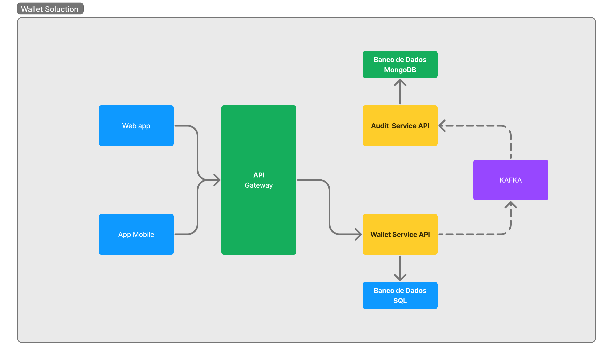
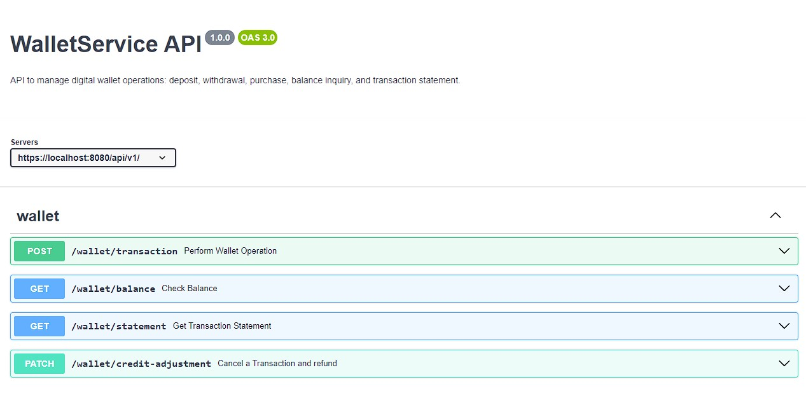
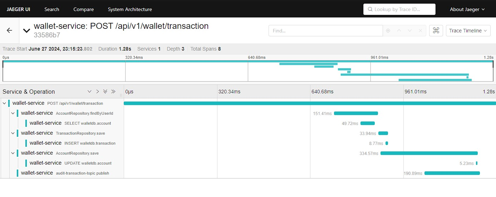

# 🚀 Wallet Service API

Uma aplicação de carteira digital que permite gerenciar transações, obter extratos, consultar saldos, realizar compras e estornos. Desenvolvida utilizando um modelo reativo não-bloqueante com Java 17 e Spring WebFlux, seguindo os princípios de Clean Code e SOLID, e implementando os padrões de design Bridge e Strategy.

* A programação reativa oferece uma abordagem moderna e eficiente para construir sistemas altamente responsivos, resilientes e escaláveis. No contexto do Spring WebFlux, ela permite a criação de APIs reativas que podem lidar com um grande número de requisições simultâneas, utilizando recursos de forma eficiente através de um modelo não-bloqueante e orientado a eventos.
* Essa arquitetura é particularmente adequada para aplicativos que precisam integrar várias fontes de dados, processar grandes volumes de eventos em tempo real, ou simplesmente melhorar a capacidade de resposta de APIs sob carga alta. A capacidade de compor operações de forma declarativa e a gestão robusta de erros tornam a programação reativa uma poderosa ferramenta no desenvolvimento de serviços modernos.

---

## 📜 Sumário

- [⚡ Tecnologias](#-tecnologias)
- [📑 Funcionalidades](#-funcionalidades)
- [📦 Estrutura do Projeto](#-estrutura-do-projeto)
- [🚀 Desenho de Solução](#-desenho-de-solução)
- [📚 Documentação](#-documentação)
- [🔌 Padrões de Design](#-padrões-de-design)
- [🛠️ Desenvolvimento](#️-desenvolvimento)
- [🛠️ Transações e Controle de Concorrência](#️-transacoes-e-controle-de-concorrencia)
- [🔍 Observabilidade](#-observabilidade)
- [🚀 Execução e Configuração](#-execução-e-configuração)
- [🌐 Referências](#-referências)

---

## ⚡ Tecnologias

Essas são algumas das tecnologias e ferramentas utilizadas no projeto:


---

## 📑 Funcionalidades

- **Extrato de Transações**: Obtenha um extrato completo de todas as transações.
- **Consulta de Saldo**: Consulte o saldo atual da conta.
- **Retirada de Valor**: Realize retiradas de valor da conta.
- **Realização de Compras**: Efetue compras, que resultam em retiradas da conta.
- **Estorno de Compras**: Cancele compras realizadas e estorne o valor para a conta.
- **Envio de Mensagem Assíncrona**: Após operações que resultam em persistência de dados, a API envia uma mensagem assíncrona para uma API de auditoria.

---

## 📦 Estrutura do Projeto

```plaintext
src
├── main
│   ├── java
│   │   └── com.dowglasmaia.wallet
│   │       ├── config
│   │       ├── controller
│   │       ├── entity
│   │       ├── enums
│   │       ├── exceptions
│   │       ├── messagemodel
│   │       ├── repository
│   │       ├── service
│   │       │   ├── impl
│   │       │   ├── mapper
│   │       ├── strategy
│   │       └── WalletApplication.java
│   └── resources
│       ├── application.yml
│       └── ...
└── test
    └── java
        └── com.dowglasmaia.wallet
            └── ...
```

---
## 🚀 Desenho de Solução


---

## 📚 Documentação

- **[Swagger /OpenAPI](src/main/resources/openapi/MS-WALLET.yaml)**:  Definição de contrato da API.
- **[Collection PostMan - API](src/main/resources/collection/Wallet%20-%20Transaction%20-%20API.postman_collection.json)**: API Postman Collection
- **[Collection PostMan - GATEWAY](src/main/resources/collection/API-GATEWAY-DOWGLAS-MAIA.postman_collection.json)**: GATEWAY Postman Collection
- **[Repositório API Gateway](https://github.com/dowglasmaia/traefik-gateway-config)**: Traefik Gateway
- **[Repositório API Audit](https://github.com/dowglasmaia/audit-transaction-service-sboot-mongodb)**: Audit Transaction Service API

 

---

## 🔌 Padrões de Design

### Bridge

O padrão **Bridge** é utilizado para separar a abstração da implementação, permitindo que ambas possam variar independentemente. Neste projeto, ele é aplicado para gerenciar diferentes tipos de transações e operações de ajuste de crédito.

- **Abstração**: A interface `TransactionService`.
- **Implementação**: As classes `CreditAdjustmentTransactionServiceImpl`, `CreateTransactionServiceImpl`, etc.

### Strategy

O padrão **Strategy** define uma família de algoritmos, encapsula cada um deles e os torna intercambiáveis. Este projeto usa este padrão para executar diferentes estratégias de cálculo de saldo, conforme o tipo de operação da transação.

- **Contexto**: `TransactionContext`, que usa uma estratégia para calcular o novo saldo.
- **Estratégias**: Diferentes estratégias de cálculo para operações como depósito, retirada e estorno.

---

## 🛠️ Desenvolvimento

### Princípios Seguidos

- **Clean Code**: Código limpo e fácil de entender.
- **SOLID**: Seguindo os princípios de design orientado a objetos, com ênfase em responsabilidade única.
- **Arquitetura Reativa**: Implementação não-bloqueante com Spring WebFlux.

### Testes

- **JUnit**: Utilizado para testes unitários.
- **Mockito**: Utilizado para criação de mocks nos testes.

---

## 🛠️ Transações e Controle de Concorrência

### Banco de Dados

Uso transacional do banco de dados para garantir atomicidade e consistência. Em operações de escrita para assegura que todas as mudanças sejam aplicadas ou nenhuma, evitando duplicação de entradas.

Mecanismos de locking, como optimistic locking (com versões) para evitar modificações concorrentes.

**Bloqueio Otimista**: Assume que as colisões de transação são raras. Cada transação trabalha com uma cópia da entidade, e, ao tentar salvar a entidade, verifica-se se houve alguma modificação desde que a entidade foi lida. Isso é normalmente implementado com um campo de versão. Se a versão na tentativa de salvamento não corresponder à versão atual no banco, uma exceção é lançada, indicando uma colisão.


### Como o Código Implementa o Bloqueio Otimista

1. **Uso da Anotação @Version:**

```java
@Version
private Long version;
```

Isso indica ao Spring que o bloqueio otimista está sendo utilizado. O Spring usa esse campo para verificar se o registro no banco de dados foi alterado por outra transação durante o tempo em que a transação atual estava operando nele.

2. **Tratamento de Conflito:**

No método `create` do serviço `CreateTransactionServiceImpl`, o bloqueio otimista é aplicado da seguinte maneira:

```java
return saveTransaction(account, transactionEntity.getOperationType(), transactionEntity.getAmount())
      .then(repository.save(account))
      .onErrorMap(OptimisticLockingFailureException.class, ex -> {
          return new BusinessException("Concurrent update error", HttpStatus.CONFLICT);
      });
```

### Garantias e Vantagens do Bloqueio Otimista

- **Evita Conflitos Silenciosos**: Garante que a operação falhe de forma explícita se ocorrer uma colisão, evitando sobreescritas não detectadas de dados.
- **Melhor Desempenho**: Em cenários onde conflitos são raros, é mais eficiente do que o bloqueio pessimista, pois não exige o bloqueio físico dos registros no banco.
- **Desempenho Escalável**: Funciona bem em ambientes distribuídos e sistemas de alta concorrência, porque minimiza a contenção e o uso de recursos.

--- 


## 🔍 Observabilidade

### OpenTelemetry e Jaeger

- **OpenTelemetry**: Instrumentação automática para coleta de métricas.
- **Jaeger**: Sistema de rastreamento distribuído para monitoramento de transações e desempenho.


---

## 🚀 Execução e Configuração

### Pré-requisitos
- **Docker**: [Instalar Docker](https://docs.docker.com/get-docker/)

**Navegue até o diretório da aplicação:**
Abra o terminal e vá até o diretório onde o `docker-compose.yml` da sua aplicação está localizado.

**Execute o Docker Compose:**
Use o comando abaixo para iniciar os containers definidos no `docker-compose.yml` da aplicação.

   ```bash
   docker-compose up
   ```

Isso iniciará todos os serviços definidos, incluindo a aplicação e o banco de dados.

#### Executar o Gateway

**Navegue até o diretório do gateway:**
Abra um novo terminal e vá até o diretório onde o `docker-compose.yml` do gateway está localizado.

**Execute o Docker Compose:**
Use o comando abaixo para iniciar os containers definidos no `docker-compose.yml` do gateway.

   ```bash
   docker-compose up
   ```

Isso iniciará o gateway e quaisquer serviços auxiliares necessários para o gateway funcionar.

**Execute para criar o Banco de Dados:**

- Conexão com Base Dados
```bash
    url: jdbc:postgresql://localhost:5432/walletDB
    username: maia
    password: maiapw
```

```roomsql
-- Criação do Banco de Dados
CREATE DATABASE walletDB;

-- Cria a extensão uuid-ossp se ainda não existir
CREATE EXTENSION IF NOT EXISTS "uuid-ossp";

-- Cria a tabela 'account' se não existir
CREATE TABLE IF NOT EXISTS account (
    id UUID PRIMARY KEY DEFAULT uuid_generate_v4(),
    number VARCHAR(255),
    user_id VARCHAR(255),
    balance NUMERIC,
    version BIGINT DEFAULT 0
);

-- Cria a tabela 'transaction' se não existir
CREATE TABLE IF NOT EXISTS transaction (
    id UUID PRIMARY KEY DEFAULT uuid_generate_v4(),
    user_id VARCHAR(255),
    amount NUMERIC NOT NULL,
    operation_type VARCHAR(100) NOT NULL,
    date_time TIMESTAMP,
    version BIGINT DEFAULT 0
);

-- Cria a tabela 'refund' se não existir
CREATE TABLE IF NOT EXISTS refund (
    id UUID PRIMARY KEY DEFAULT uuid_generate_v4(),
    user_id VARCHAR(255),
    transaction_id UUID NOT NULL,
    amount NUMERIC NOT NULL,
    date_time TIMESTAMP,
    FOREIGN KEY (transaction_id) REFERENCES transaction(id),
    version BIGINT DEFAULT 0
);

-- Insere dados de exemplo na tabela account
INSERT INTO account (id, number, user_id, balance)
VALUES (uuid_generate_v4(), '001', 'user123', 0);

INSERT INTO account (id, number, user_id, balance)
VALUES (uuid_generate_v4(), '002', 'user129', 0);


```

---

## 🌐 Referências

- [Opentelemetry Docs](https://opentelemetry.io/docs)
- [Jaeger Docs](https://www.jaegertracing.io/docs)
- [Spring Webflux](https://docs.spring.io/spring-framework/reference/web/webflux.html)
- [Dockerfile Reference](https://docs.docker.com/reference/dockerfile)
- [Kafka Docs](https://kafka.apache.org/documentation/)
- [PostgreSQL Docs](https://www.postgresql.org/docs/)
- [Spring Webflux Concurrency](https://www.baeldung.com/spring-webflux-concurrency)

